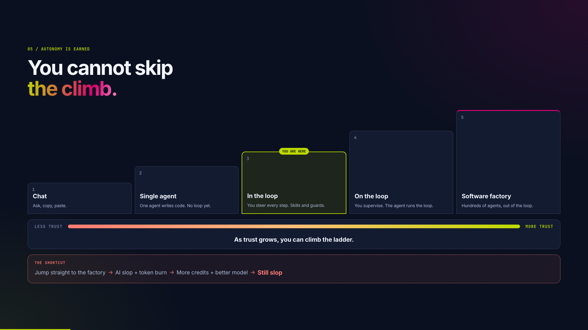
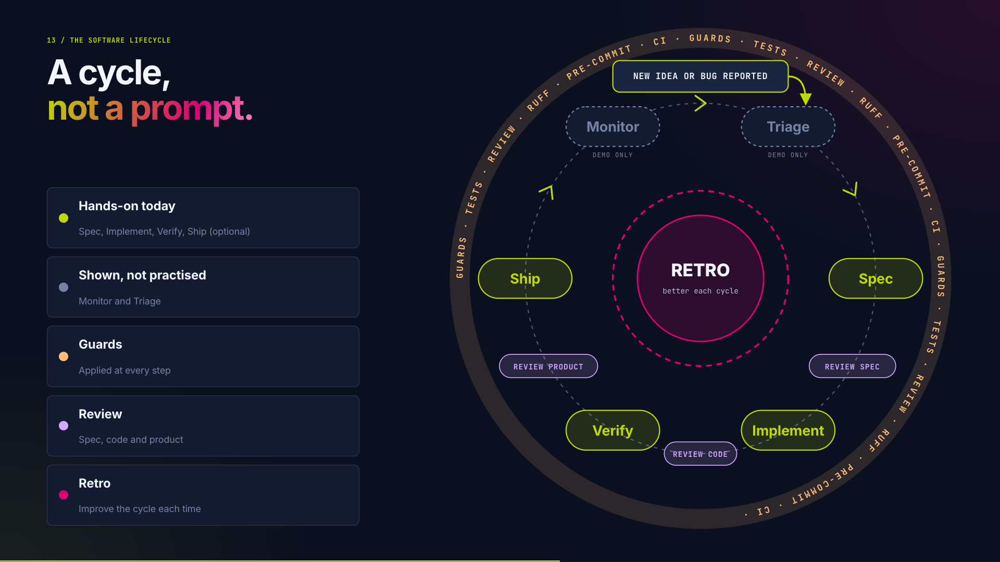

# Self-guided workshop guide

This guide turns the DevDay workshop into a self-paced exercise. You will use a
small fictional product, Grid Guardian, to practise one development loop:

```text
Triage -> Specify -> Implement -> Review -> Guard -> (Ship) -> Retro
```

Guards (tests, Ruff, pre-commit) apply at every step, not only at the end. Review
happens at several points: the spec, the code, and the running product.

The point is not to make an agent write a feature from one large prompt. The
point is to use an agent at each step while you keep ownership of the problem,
the decisions, and the quality bar. Your role is to start each skill, inspect
what the agent produces, answer its questions, and decide what to accept.

Underneath sits one idea: trust is built, not bought. Before you let an agent
work with more autonomy, you need to trust it. That trust comes from watching the
agent deliver, inside the loop, with specs, skills, guards, and retros around it.
Every time a guard catches a mistake or a review confirms the result, the agent
has earned a bit more of your trust. A pricier model can't always fix a missing
process.



Today you work at the third rung, in the loop. This guide is only the
introduction. It shows the building blocks (specs, skills, guards, and retros),
but it does not move you up a rung by itself. That happens slowly, after the
workshop: you build your own workflows into your tools, tweak your skills and
agents bit by bit, and let your agents earn your trust along the way.

The software lifecycle below shows where each checkpoint in this guide sits.
Spec, implement, verify, and optionally ship are hands-on. Triage and monitor are
shown only. Guards run around every step, review happens at the spec, the code
and the product, and the retro sits in the centre and improves the next cycle.



This workshop was created to teach AI-assisted development with the Enexis AI
Platform tools. You can still follow it with your own AI tools. The repository's
skills are self-contained, and the main lesson is the development flow and how
to use AI at each step. The exact agent harness or MCP setup may differ, but the
triage, specification, implementation, review, and guardrail work remains the
same.

Many of the workflow skills in this repository come from [Matt Pocock's skills
repository](https://github.com/mattpocock/skills). Thanks to Matt for sharing
that work. We use the skills as practical starting points and adapt them to this
repository and workshop. Thanks as well to [Lauren Tan](https://github.com/poteto)
for her work on agent skills and retros. The tools are examples; the lesson is the
software lifecycle, and any tool that supports it will do.

## Follow along with the presentation

The workshop presentation is in [`presentation/index.html`](../../presentation/index.html).
Open it next to this guide if you want extra context. Press the arrow keys to
move between slides. The slides before 28 cover the intro and the platform
onboarding, which this guide does not reproduce.

**The hands-on workshop starts at slide 28 (Software lifecycle).** From there:

| Slides | Topic | Guide section |
| --- | --- | --- |
| 28-30 | Software lifecycle, the Grid Guardian story, credits | Introduction, The Grid Guardian story |
| 31-32 | Triage and Monitor-to-triage (shown only) | Checkpoint 1: triage |
| 33-35 | Specify, grilling workflows, Pause + Do: Spec | Checkpoint 2: specify |
| 36-37 | Session management, Pause + Do: Handoff | Checkpoint 2.5: hand off the session |
| 38-39 | Implementation, Pause + Do: Implement | Checkpoint 3: implement with TDD |
| 40-41 | Review, Pause + Do: Review | Checkpoint 4: review |
| 42-44 | Guards, Pause + Do: Guards, Rails | Checkpoint 5: guardrails |
| 45-46 | Ship, Pause + Do: Ship (optional) | Checkpoint 6: ship |
| 47-49 | Retro, Retro control, Pause + Do: Retro | Checkpoint 7: retro |
| 50 | Takeaways | Optional stretch work |

Each **Pause + Do** slide has a goal, concrete steps, and a done-when line. They
match the "Pause and record" parts of this guide.

## What you will do

You will start with an incomplete feature request for a fictional dashboard.
You will classify it, settle its behavior, implement one tested change, review
the result, run the checks that protect the repository after you leave, and
finish with a retro that improves the next cycle. Opening a pull request is
optional.

Plan for about one and a half hours. Work through the checkpoints at your own
pace, and take a break whenever you need one. Do not skip triage, specification,
or review to make up time. If the exercise runs long, skip the optional stretch
work first.

## The people and the products

Two teams meet in this workshop.

The AI Platform Team builds and provides reusable AI tools that developers can
use. These include agent harnesses, model access, and MCPs. Its product is the
platform and the support around it. This repository includes Context7 as an
example of an MCP that people can use without authenticating. Other MCPs may
require access provided by the AI Platform Team.

The AI Usecase Solution Engineering Team uses those tools to build custom AI
solutions for internal process automation. Its product is the solution for a
particular process.

The boundary matters. A platform tool can help you inspect a repository or
check current library documentation. It does not decide what Grid Guardian
should show an event coordinator. You make that decision, record it, and review
the code that follows from it.

## Use AI responsibly

Choose the model and context for the task. You might be surprised by how smart
smaller models are nowadays.

- Use a smaller, less expensive model for most tasks. I generally use larger
  models only for the specification or review of very complex changes, which
  is a rare occasion. All my code gets implemented by smaller models, such
  as Luna.
- If you have a good specification and strong quality guardrails, such as unit
  tests and Ruff, you do **not** need a large model to write your code. The small
  model should be your default. Only try a stronger model if the smaller one
  cannot do the job.
- This gives you much more value from your weekly credits. As an example, this
  entire workshop was created with help from Luna, including the repository,
  code, presentation, and content refinement, and it only used about 6% of
  my weekly budget.
- We all like to think our work is very complex and that only the very best
  models can handle it. Fortunately, or unfortunately, that has not really been
  the case for the last few months.
- Keep the context focused on the issue, relevant files, and the decision you
  are making.
- Do not send the whole repository when a few files answer the question.
- Keep private data, credentials, tokens, internal URLs, and operational data
  out of prompts and public artifacts.

The agent can suggest a category, an acceptance criterion, or a test. You still
decide whether the suggestion is correct.

## Setup

### Access and environment

This repository is public-safe. It does not contain the private access route for
the Enexis AI platform. Before you start, obtain the following from the Enexis
AI Platform Team:

- An approved agent harness and model access.
- The model name and endpoint that your environment allows.
- Any MCP configuration that the AI Platform Team provides for the workshop.
  Context7 is already included in this repository as a public, no-auth example.
- The support channel for setup problems.

Use placeholders in notes and screenshots. Do not add private URLs, credentials,
live QR destinations, internal identifiers, Vault or registry details, or real
operational data to this repository.

OpenCode V1 is the guaranteed path for the live workshop. An equivalent agent
harness may work for this self-guided version, and the repository's self-contained
skills still explain the same workflow. Your own tool's setup, model routing,
and integrations are your responsibility.

### Clone and install

Clone the repository, enter it, install the dependencies, and install the local
pre-commit hooks:

```bash
git clone <your-public-repository-url>
cd devday-workshop-ai-assisted-development
uv sync --no-upgrade
uv run prek install -f
```

If you do not have `uv`, install it using the instructions for your operating
system from the official `uv` documentation.

### Smoke test

Open the repository in OpenCode V1, or in your equivalent agent harness. Restart
the harness after opening the repository so it loads the project-level
configuration. Confirm that Context7 is available through the project
configuration. It is included as a public, no-auth MCP example.

Ask the agent:

```text
Use the workshop repository to identify the current test command and explain
what the application does. Do not change any files.
```

Then check the result yourself:

1. The agent could read the repository.
2. It identified the Streamlit run command and test command correctly.
3. The project configuration loaded as expected.
4. Context7 is available through the project configuration.
5. `git status` shows no unexpected changes.

Run the application only after the smoke test:

```bash
uv run streamlit run src/devday_workshop_ai_assisted_development/app.py
```

If setup fails, pair with someone whose setup works. Compare the environment,
not private credentials. You can still read the issue and write the
specification without platform access, but you need a working Python checkout to
run the tests and application.

### Platform onboarding insertion point

In the live workshop, this is the AI Platform Team's section. Use its onboarding
material to learn how to request access, choose an allowed model, configure the
supported agent harness, and ask for help.

This guide intentionally does not reproduce that section. Platform URLs, key
routes, model names, QR destinations, internal MCP names, and roadmap details
are environment-specific. Once the AI Platform Team confirms access, return to
the smoke test above.

## The Grid Guardian story

Grid Guardian is a fictional dashboard for Glowtown's Night of Lights festival.
It shows the status of a few neighborhoods and uses fixture incidents. It does
not use real grid data.

The local issue is the portable source of truth:

`.scratch/grid-guardian/issues/01-grid-guardian-briefing.md`

The request says:

> The Night of Lights is tonight. Extend the existing Grid Guardian dashboard
> with a quick power briefing for a selected neighborhood: its current status
> and the one active incident that needs attention most.

The existing dashboard already shows Lantern Row, Copper Park, and Beacon Hill.
It marks a neighborhood as `Attention needed` when it has at least one active
incident. Otherwise it shows `Stable`.

To see the dashboard, run this from the repository root:

```bash
uv run streamlit run src/devday_workshop_ai_assisted_development/app.py
```

Leave it running while you work, and refresh the browser after the agent changes
the code.

The change must stay small. Do not redesign the product or add incident
management. Keep the Streamlit layer focused on collecting a neighborhood and
rendering the result. Put the briefing rules in a small testable domain seam.

The fixtures include active and resolved incidents, severity, event time, and
fields that must not appear in the user-facing briefing. Treat all fixture data
as fictional input. The briefing must not expose fixture or internal metadata.

Feel free to think of your own feature as well. The important part is that you
implement it by following the flow described in this workshop.

## Checkpoint 1: triage

The issue starts as:

- Category: `enhancement`
- State: `needs-triage`

That is a starting point, not the final decision. Triage asks whether the request
is understood well enough for the next step.

In the live workshop the facilitator only demonstrates triage, because triage matters
less when you work in the loop yourself. Here you can run it once to see how it
works. In a mature setup it can run automatically, for example when a monitoring
alert creates an issue. Today you start hands-on at specification.

### Run the process

Use the repository's `/triage` skill if your agent harness supports it. Otherwise,
follow the same process manually:

1. Gather context from the issue, the existing application, the fixtures, and
   the repository guidance.
2. Recommend exactly one category, either `bug` or `enhancement`.
3. Recommend one state: `needs-triage`, `needs-info`, `ready-for-agent`,
   `ready-for-human`, or `wontfix`.
4. Verify the claim against the repository. Check whether the feature already
   exists and whether the issue is missing information.
5. If behavior is still unclear, record the questions and move to
   `needs-info`, or continue to specification if that is the agreed next step.
6. Apply the outcome in the local issue or in your own issue tracker.

Every triaged issue should have exactly one category and one state. The local
tracker records those values in the issue file.

### Pause and record

Using your AI agent and the `/triage` skill, generate a triage note containing:

- The category and state.
- What you verified in the repository.
- Why the request is or is not ready for specification or implementation.
- Missing information, dependencies, and risks.
- The next action and its owner.

Do not start coding yet. The request is intentionally not fully specified.

## Checkpoint 2: specify

Specification turns the open behavior questions into decisions that a test can
express. Start from the issue and the repository. Do not ask the agent to
implement the story yet.

### Use grilling

Use `/grill-me` or `/grill-with-docs` if those skills are available. Both use the
same interview process:

1. Ask the questions that are ready to answer.
2. Recommend an answer and make the trade-off visible.
3. Wait for the person's answers.
4. Recompute the remaining frontier.
5. Stop only when every branch is settled.

`/grill-me` runs the interview without the document-recording workflow (stateless). Use it
when you need to settle a decision in the current session.

`/grill-with-docs` combines the interview with domain-modeling (stateful). It records
settled decisions in project documents such as ADRs and glossary entries. Use it
when the vocabulary or decision should remain in the project after this task. I
almost always use `/grill-with-docs` because I see few downsides compared with
`/grill-me`, and it often has useful advantages.

### Observe the specification interview

Let the agent inspect the issue and repository, then identify the open decisions
it needs to settle. Do not give it a pre-filled list of questions or answers.
Watch how it asks questions in rounds, recommends answers, waits for your input,
and finds the next questions from your answers.

Pay attention to:

- Which questions the agent asks.
- Which questions it asks first, and why.
- Whether it explains the trade-offs behind its recommendations.
- How your answers change the next round of questions.
- When the agent decides that the specification is complete.
- Whether it records examples, acceptance criteria, and out-of-scope notes.

If the implementation depends on current library or testing-library behavior,
watch whether the agent uses Context7 to check the documentation.

### Pause and record

Once the interview is complete, use `/to-spec` to turn the decisions into a
specification. Then use `/to-tickets` to turn that specification into one or
more implementation tickets.

From this point on, the specification and tickets are the ground truth for the
AI-assisted development workflow. They define what implementation should do,
what stays out of scope, and what later specification reviews should check. Grid
Guardian is only the example used in this workshop. In a real project, the same
artifacts should guide implementation and review.

The specification should be clear enough for another person or agent to use
without reading the conversation. Check that it includes:

- Settled behavior and domain terms.
- Examples for known, unknown, empty, and competing-incident cases.
- Acceptance criteria that can become tests.
- Fields the user may see and fields that must stay hidden.
- Explicit out-of-scope behavior.
- The relevant files and the test command.

Check that `/to-tickets` creates a small implementation task with the right
scope and blocking relationships. For this exercise, the first implementation
ticket should cover one tested vertical slice, not a product redesign.

If you use `/grill-with-docs`, inspect the ADR or glossary changes as well. They
are part of the output, but they do not replace `/to-spec` or `/to-tickets`.

I usually don't spend a lot of time reading documents an agent produces for
other agents, because they can be very verbose. If the agent and I have reached
a shared understanding in the chat, I generally trust that the agent-to-agent
documents are clear enough. When I first use a new skill, though, I inspect its
output from time to time to see whether it works well.

This applies to documents meant mainly for other agents, not for humans. When I
generate documentation for humans to read, I always read and understand it
myself.

## Checkpoint 2.5: hand off the session

Finish the specification before starting a new implementation session. You can
use `/handoff` whenever you switch to a new session between workflow steps and
want to carry over context from the previous session. For this example, use it
after writing the specification and tickets, before implementation.

The handoff should tell the next session to implement the tickets using the
specification and tickets as ground truth for the workflow. The next session
should not reopen settled product decisions unless it finds a concrete
contradiction or missing requirement.

For example:

```text
Let's use /handoff to start a clean session that will /implement the tickets we
just wrote.
```

For the same reasons as described earlier, I usually don't read the handoff
itself when it is only for the next agent session to read.

For really big changes, I usually start a clean session for each ticket created
with `/to-tickets`. If a ticket is especially complex, I sometimes start
another grilling session for that ticket before implementation. That is often
overkill, though. Agents have become smart enough that we do not need to
babysit them as much as we used to.

The handoff should carry over what the next session needs:

- The issue and settled acceptance criteria.
- Decisions and examples.
- Files to inspect or change.
- The public seam to test.
- Commands to run.
- Known risks and the next action.

Do not copy a whole chat transcript. A good handoff lets a fresh session begin
implementation without reopening settled product decisions.

## Checkpoint 3: implement with TDD

Implementation is one small tested change from the generated tickets. In normal
work, use `/implement` when it is available. It runs the implementation and
review workflow for you. For this workshop, use `/devday-implement` instead, so
you can go through the implementation step by step. It includes the TDD loop
and stops before review so you can pause and record before the next step.

Before coding, read [`CODING_STANDARDS.md`](../../CODING_STANDARDS.md). It
describes the repository's expectations for the public domain seam, thin
Streamlit adapter, tests, domain vocabulary, safe fixture data, and narrow
changes. The implementation skill should follow those standards, and the later
`/code-review` Standards review checks the result against them.

This `CODING_STANDARDS.md` is only a quickly generated example for the
workshop. In a real team, you could share one standards document across several
projects, for example by keeping it in Confluence and teaching the skill to read
the linked page through the Atlassian MCP. You could also keep one standards
file per project when the rules depend on the codebase. Pick one clear source of
truth and make the implementation and review skills read it consistently.

Work in vertical slices:

1. **RED:** Write a failing behavior test at the public domain seam. Start with
   one acceptance criterion from the specification or ticket.
2. **GREEN:** Implement only enough behavior to pass that test.

Keep the implementation small and the Streamlit layer thin. Refactoring belongs
to the review stage, after the behavior works and the implementation can be
reviewed against the specification and tickets.

You should see the agent run the focused test file after each slice, then run the
full test suite and the repository's formatter or type checks when the
implementation is complete.

### Pause and record

Leave these artifacts in the working tree:

- Tests that express the settled behavior.
- The smallest implementation diff that makes them pass.
- The focused test result.
- The full test and check results.
- Any uncertainty that review must address.

Do not run `/code-review` or `/user-review` as part of implementation. Review is
the next checkpoint.

## Checkpoint 4: review

"The tests pass" is not the review. Review the change from separate viewpoints.

### Standards and specification review

Run `/code-review` against the implementation diff if available. It reports two
axes separately:

- **Standards:** Does the change follow the repository's documented standards in
  [`CODING_STANDARDS.md`](../../CODING_STANDARDS.md)?
- **Spec:** Does it implement the specification, the tickets, and every settled
  acceptance criterion?

Do not let a standards pass hide a specification failure, or the reverse.

### User review

`/user-review` needs Playwright and a configured browser-capable MCP. Installing
and configuring Playwright is an extra for this workshop, not a prerequisite for
the core development flow. The [README](../../README.md#optional-tools) has the
install commands for Node.js and Chromium; the repository's `opencode.json`
already configures the Playwright MCP. When it is available, the agent runs `/user-review`
against the Streamlit application and exercises the user journeys itself.

Your job is to inspect what the agent does and think about why. Look at whether
it checks a known neighborhood, an unknown neighborhood, and a neighborhood with
no active incidents. Notice whether it checks that an event coordinator can
understand the result and that no fixture metadata, internal identifiers,
credentials, or operational data appears.

If Playwright is unavailable, just skip this review step for now.

### Pause and record

Read the findings the agent reports. A good finding tells you what is wrong,
where, and why it matters. For each one, ask yourself:

1. **Is it real?** Does the finding point at something that is actually in the
   code or the running app, or did the agent misread it? If the agent gives
   steps to reproduce, try them.
2. **Does it matter?** Is it a broken requirement or a security leak (fix it),
   or a style preference (maybe skip it)?
3. **Which review found it?** `/code-review` reports Standards (does it follow
   `CODING_STANDARDS.md`?) and Spec (does it match the specification?).
   `/user-review` reports what a user would experience. Knowing the source tells
   you which document to check the finding against.

Then decide, for each finding, whether it must be fixed before the guardrail step.
Do not accept every finding by default. Some will be noise, and you decide.

Ask the agent to fix the findings that need a fix, then repeat the relevant
review. Inspect the diff and the behavior after each fix. The outcome is a
reviewed change, not just a statement that the tests passed.

## Checkpoint 5: guardrails

Guardrails rerun the quality checks after the change. They make the workflow
repeatable and keep generated code within repository standards. They may seem
small and inconsequential, but they make a huge difference to the quality of the
code produced. Agents need something to test against and something to reference.
These guardrails provide both, with very little extra latency.

The agent should already have been doing this, but once more let your agent run
the repository commands:

```bash
uv run pytest
uv run ruff check .
```

Run the local pre-commit checks as well:

```bash
uv run prek --all-files --show-diff-on-failure
```

CI should run the same repository checks for every change. For this public repo
we have not set up a CI/CD pipeline, but remember to set one up for your own
codebases!

Guards are not a final step. Tests, Ruff, and pre-commit run while you
implement, before you commit, and (in a real project) in CI. Each one verifies
something different, and together they keep the agent on track.

## Checkpoint 6: ship (optional)

Only do this if you have the GitHub CLI (`gh`) set up and authenticated for a
repository you may push to, for example your own fork. The
[README](../../README.md#optional-tools) has the install and `gh auth login`
commands. Work in your local clone
and keep the result out of any shared repository.

Tell the agent:

```text
Create a PR with the gh cli and the /pr skill.
```

Then read the PR body yourself. Check that it describes the behavior, the tests,
and the review outcome, and that it contains no private data.

Fixing CI failures and handling review comments are part of shipping in a real
project, but they are not part of this exercise.

## Checkpoint 7: retro

A retro makes the next cycle better. Run `/retro` on your session and read the
suggestions it makes. Choose one improvement yourself and write it into the
repository, for example a sharper instruction, a small skill tweak, or a new
guard.

Do not automate the retro. An agent that applies every suggestion by itself
causes drift. `AGENTS.md` keeps growing, and the agent half-ignores it. Any skill
or harness setup you pile up also makes you less flexible: when a new model
arrives, your setup may no longer work, and you carry the cost of changing it.
You verify the suggestions and decide what to change and what to leave alone.

## Optional stretch work

Only do this after the core exercise passes.

1. Authenticate and try the Atlassian MCP (Enexis-only). Read a Confluence document and a
   Jira user story from your scrum board. Use only data you are allowed to
   access, and do not copy private content into this public repository.
2. Use `/implement` instead of `/devday-implement` and observe how it runs the
   implementation and review workflow.
3. Tinker with your opencode.json configuration.
4. Edit a skill to your liking and try the changed skill on the exercise.
5. Create specific review subagents that are not allowed to edit files. Use them
   to inspect the implementation and report findings.
6. Use `/brag-slim` to create a short video of the fictional product.

Feel free to let your creativity run free and add a second product feature to
extend the exercise. Try to keep stretch work focused on trying the workflow,
the tools, or the skills.

For the video, show the fictional product only. Do not show private platform
configuration, credentials, internal URLs, or real operational data. Keep it
to about 15-25 seconds, and cancel the activity if it gets in the way of the
core exercise.
